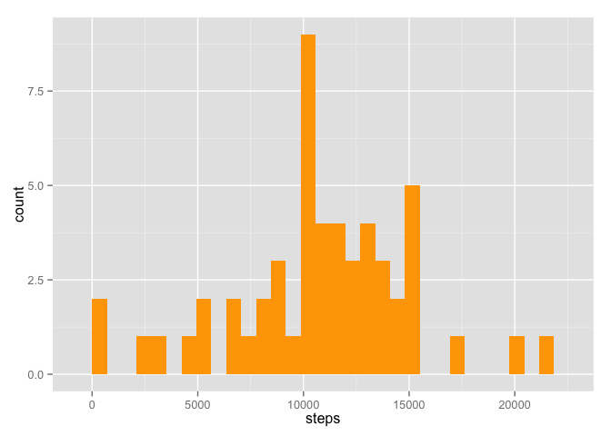
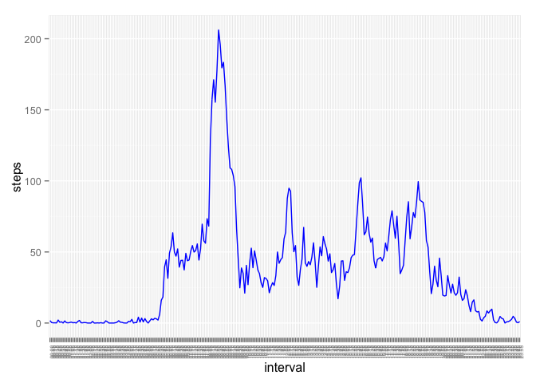
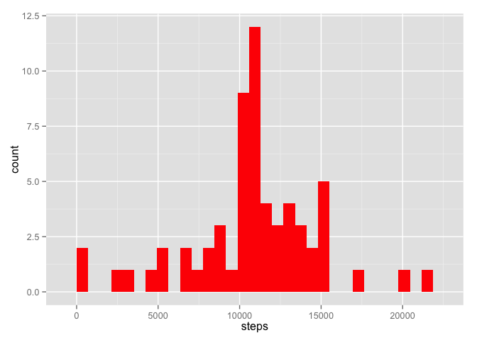
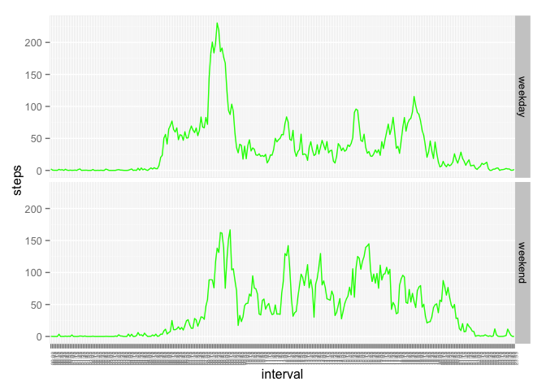

# Reproducible Research: Peer Assessment 1


## Loading and preprocessing the data


```r
# download data and unzip into folder
if(!file.exists("./activity.zip")){
        fileUrl = "https://d396qusza40orc.cloudfront.net/repdata%2Fdata%2Factivity.zip"
        download.file(fileUrl, destfile = "./activity.zip", method = "curl")}
library(utils)
unzip ("./activity.zip")

# read dataset and process
data = read.csv("activity.csv")

# convert date variable to Date class
data$date = as.Date(data$date, "%Y-%m-%d")

# convert interval variable into more readable format
four_digits = sprintf("%04d", data$interval)
data$interval = paste(substr(four_digits, 1, 2), substr(four_digits, 3, 4), sep = ":")
data$interval = as.factor(data$interval)
```

## What is mean total number of steps taken per day?

```r
# Calculate the total number of steps taken per day (ignoring NAs)
steps_per_day = aggregate(steps ~ date, data, sum)

# Make a histogram of the total number of steps taken each day
library(ggplot2)
p_steps = ggplot(steps_per_day, aes(steps))
p_steps + geom_histogram(fill ="orange")
```

```
## stat_bin: binwidth defaulted to range/30. Use 'binwidth = x' to adjust this.
```

 

```r
# Calculate and report the mean and median of the total number of steps taken per day
mean(steps_per_day$steps)
```

```
## [1] 10766.19
```

```r
median(steps_per_day$steps)
```

```
## [1] 10765
```


## What is the average daily activity pattern?

```r
# Make a time series plot of the 5-minute interval and the average number of steps taken
avg_steps = aggregate(steps ~ interval, data, mean)
p_avg = ggplot(avg_steps, aes(x=interval, y=steps, group=1))
p_avg + geom_line(color="blue") + theme(axis.text.x = element_text(size=5, angle=90, vjust=1)) 
```

 

```r
# Which 5-minute interval, on average across all the days in the dataset, contains the maximum number of steps?
avg_steps$interval[which.max(avg_steps$steps)]
```

```
## [1] 08:35
## 288 Levels: 00:00 00:05 00:10 00:15 00:20 00:25 00:30 00:35 00:40 ... 23:55
```


## Imputing missing values

```r
# calculate NA percentage
mean(is.na(data$steps))
```

```
## [1] 0.1311475
```

```r
# using interval mean to replace all NA value
missing_value = rep(avg_steps$steps, length(unique(data$date)))

# create a new dataset that is equal to the original dataset but with the missing data filled in
data_new = data
for (i in 1:nrow(data_new)) {
  if (is.na(data_new$steps[i]) == TRUE) {data_new$steps[i] = missing_value[i]}
}

# make a histogram of the total number of steps taken each day
steps_new = aggregate(steps ~ date, data_new, sum)
p_steps_new = ggplot(steps_new, aes(steps))
p_steps_new + geom_histogram(fill ="red")
```

```
## stat_bin: binwidth defaulted to range/30. Use 'binwidth = x' to adjust this.
```

 

```r
# calculate mean and median
mean(steps_new$steps)
```

```
## [1] 10766.19
```

```r
median(steps_new$steps)
```

```
## [1] 10766.19
```

## Are there differences in activity patterns between weekdays and weekends?

```r
# get information from date variable
data_new$day = c()
for (i in 1:nrow(data_new)) {
        if (weekdays(data_new$date[i]) != "Saturday") {
                if (weekdays(data_new$date[i]) != "Sunday") {data_new$day[i] = "weekday"}
                else {data_new$day[i] = "weekend"}}
        else {data_new$day[i] = "weekend"}
}

# calculate average based on weekdays and weekends
steps_weekday = data_new
steps_weekend = data_new
for (i in 1:nrow(data_new)) {
        if (data_new$day[i] == "weekend"){steps_weekday$steps[i] = NA}
        else {steps_weekend$steps[i] = NA}
}
avg_weekday = aggregate(steps ~ interval, steps_weekday, mean)
avg_weekend = aggregate(steps ~ interval, steps_weekend, mean)
avg_weekday = cbind(avg_weekday, day = rep("weekday", nrow(avg_weekday)))
avg_weekend = cbind(avg_weekend, day = rep("weekend", nrow(avg_weekday)))
data_split = rbind(avg_weekday, avg_weekend)

# plot
p_day2 = ggplot(data_split, aes(x=interval, y=steps, group=day))
p_day2 + geom_line(color="green") + facet_grid(day ~ .) + theme(axis.text.x = element_text(size=5, angle=90, vjust=1)) 
```

 
